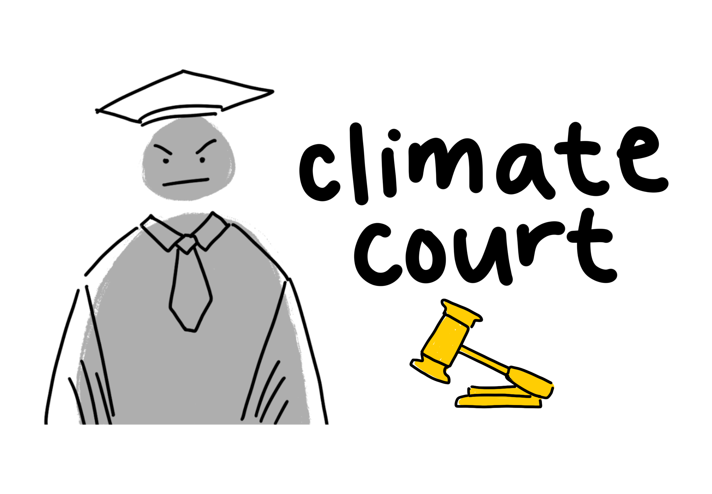

# Climate Court



> *“The number one thing we can do is the exact thing that we're not doing: talk about it.”* — **Dr. Katharine Hayhoe**  *(climate scientist & Chief Scientist at The Nature Conservancy)*

**Climate Court** turns that conversation into an **interactive courtroom drama** where everyday choices stand trial. Confess your climate “crimes,” let a jury of peers decide your fate, and receive a verdict that’s as witty as it is thought-provoking. 

By using <ins>humor</ins>, <ins>judgement</ins>, and a <ins>snarky judge</ins> to tie it together, Climate Court brings climate consciousness into  conversations that people can have, even beyond the platform. 

---

## 💡 Inspiration

We all bargain with ourselves when it comes to the climate:

* *"I'll go get lunch at the Ackerman Student Union today, even though I have some vegetables that might go bad soon...”*  
* *“I’ll take the car to the gym - leg day starts after I park!”*

Despite efforts to be sustainable, we often compromise these efforts when it comes to our own priorities. Those private negotiations inspired Climate Court — an anonymous space that swaps inner guilt for public judgment. By mixing humor with accountability we lower the barrier to honest climate talk and turn **ignorance** of these guilty pleasures into **constructive reflection**.

---

## 🔍 What It Does

| Stage | What happens | Tech |
|-------|--------------|------|
| **1 Confess** | Users anonymously confess their climate crime (or climate compassion!) & optional context. | React, Next.js |
| **2 Deliberate** | Community votes **Yay/Nay** in real time. | Firebase Realtime DB |
| **3 Verdict** | A Gemini-powered judge slams the gavel and delivers a sarcastic yet funny ruling. | Google Gemini 2.0 Flash |
| **4 Reflect** | Submitter sees final tallies and other users' climate crimes to spark additonal thought. | React, Next.js |

---

## 🛠 How We Built It

### Frontend
* **Next.js** (App Router, Turbopack)  
* **Tailwind CSS + daisyUI**  
* **Framer Motion** for gavel & crowd animations  
* **React Context** for global vote state  

### Backend & Realtime
* **Firebase Realtime Database** (live vote counts)  
* **Firestore** (climate-crime archive)  
* **Cloud Functions** (vote tally + Gemini calls)  

### AI
* **Gemini 2.0 Flash** via Google AI Studio  

### DevOps
* **GitHub Actions** (CI + preview deploys)  
* **Vercel** for hosting  

---

## 🧩 Challenges

| Challenge | Solution |
|-----------|----------|
| Humor **vs.** education | Iterated prompts until the judge was sassy but still informative. |
| Anonymous yet accountable UX | Designing server-side vote tracking and single vote per prompt per session |
| Wildly different confession lengths | Dynamic prompt templates and Gemini creative generation |
| Animation timing | Custom React hook that triggers 3× gavel strike when `isVoting` flips |

---

## 🏆 Wins We’re Proud Of

* **Judge with personality** — users receive unique and witty verdicts from Judge Bob
* **Live courtroom feel** — crowd sprites that yay/nay in sync with votes
* **Zero-friction access** — anonymous and instant participation  

---

## 📚 What We Learned

* Prompt engineering for consistent character voices  
* Psychology of humor in climate communication  
* Fine-grained Firebase security rules  
* Tailwind × Framer Motion choreography for animations 

---

## 🚀 What’s Next
* **More Lively Courtroom... OBJECTION!** - A feature we really wanted to implement given the time, allow the users to debate each other by extending voting time through objections
* **Impact meter** – show estimated CO₂ for each crime, calculated by Gemini's estimates of quantitative environmental impacts
* **Multiple judge personas** – from lenient “Optimist Oak” to ruthless “Justice Carbon”, users can get a perspective from a wide range of personalities

---

## 🔧 Local Development

```bash
# Install deps
npm install

# Run dev server
npm run dev
# → http://localhost:3000
